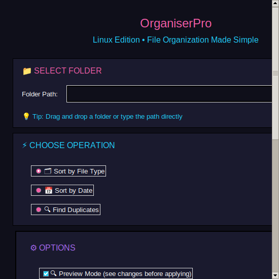

# 🗂️ OrganiserPro — Linux Edition

[](https://pypi.org/project/organiserpro/)
[](https://github.com/TheSolutionDeskAndCompany/organiser-pro/actions/workflows/ci.yml)
[](https://opensource.org/licenses/MIT)
[](https://www.linux.org/)
[](https://github.com/TheSolutionDeskAndCompany/organiser-pro)

<div align="center">
  
</div>

## What is OrganiserPro?

OrganiserPro is a modern, neon-themed Linux desktop app for sorting, deduplicating, and managing your files safely—with one click.  
Easy for beginners, powerful for experts.  
**No command line. No complex setup. Just organize.**

## 🚀 Quick Start

```bash
./install_and_run.sh
```

## ✨ Features

* Sorts files by type or by date into organized folders
* Finds and removes duplicate files (safe, preview before delete)
* Modern, easy-to-use GUI with drag-and-drop
* Progress bar and visual feedback for all operations
* Runs on all major Linux desktops (GNOME, KDE, XFCE)
* Clean, cyberpunk/neon UI — no ugly default widgets

## 📸 Screenshots

<div align="center">
  
</div>

## 🛠️ Troubleshooting

* **No icon in menu?** Log out and back in, or run:

  ```bash
  update-desktop-database ~/.local/share/applications
  ```

* **App won't launch?**

  * Make sure Python 3.8+ is installed (`python3 --version`)
  * Run the installer script from inside the extracted folder

## 📄 License

MIT — see [LICENSE](LICENSE)

## 🤝 Contributing

Want to help? [Open an issue](https://github.com/TheSolutionDeskAndCompany/organiser-pro/issues) or see [CONTRIBUTING.md](CONTRIBUTING.md).

## 📞 Support

* **Issues & Bugs**: [GitHub Issues](https://github.com/TheSolutionDeskAndCompany/organiser-pro/issues)
* **Email**: [contact@thesolutiondesk.ca](mailto:contact@thesolutiondesk.ca)
* **Website**: [https://thesolutiondesk.ca](https://thesolutiondesk.ca)

## 🗺️ Roadmap

* Flatpak/AppImage package
* Undo/restore operations
* Windows and Mac support (future)

---

> **Always keep the README focused on what works right now!**
